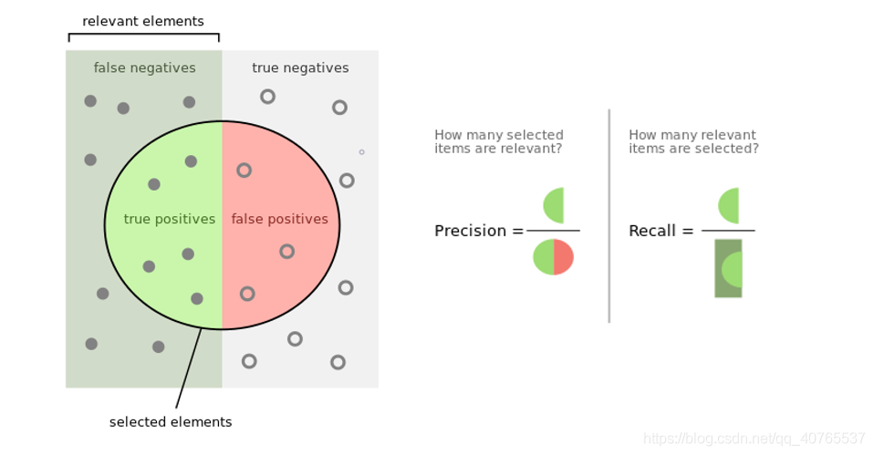
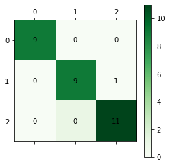

# 机器学习结课报告


<!-- TOC -->

- [机器学习结课报告](#机器学习结课报告)
    - [实验内容](#实验内容)
    - [实验数据](#实验数据)
        - [Iris数据集介绍](#iris数据集介绍)
        - [数据读取与预处理方法](#数据读取与预处理方法)
    - [实验指标](#实验指标)
        - [基本概念](#基本概念)
        - [precision](#precision)
        - [recall](#recall)
        - [f1-score](#f1-score)
        - [权重平均](#权重平均)
        - [数据集分析](#数据集分析)
    - [实验方法](#实验方法)
        - [K-Means](#k-means)
        - [DBSCAN](#dbscan)
        - [支持向量机](#支持向量机)
        - [神经网络方法](#神经网络方法)
        - [KNN（K Near Neighbor）](#knnk-near-neighbor)
        - [多项逻辑斯蒂回归](#多项逻辑斯蒂回归)
        - [决策树与随机森林](#决策树与随机森林)
    - [报告总结](#报告总结)
        - [各种分类算法的各项指标权重平均](#各种分类算法的各项指标权重平均)
        - [分析](#分析)
        - [后记](#后记)

<!-- /TOC -->

## 实验内容

- 运用机器学习相关知识，对iris数据集进行分类
- 运用相关评价指标，评估8种机器学习模型的分类效果
- 总结所使用机器学习的核心算法，加深对知识的理解

## 实验数据
### Iris数据集介绍
- Iris数据集是常用的分类实验数据集，由Fisher, 1936收集整理。Iris也称鸢尾花卉数据集，是一类多重变量分析的数据集。
- 数据集包含150个数据样本，分为3类，每类50个数据，每个数据包含4个属性。可通过花萼长度，花萼宽度，花瓣长度，花瓣宽度4个属性预测鸢尾花卉属于（Setosa，Versicolour，Virginica）三个种类中的哪一类。

### 数据读取与预处理方法
  - 可采用sklearn自带的load_iris()方法读取，并将数据集划分为训练集和测试集，比例为4:1
    ```python
    def getdata():
        train_data=load_iris()
        data=train_data['data']
        labels=train_data['target'].reshape(-1,1)
        total_data=np.hstack((data,labels))
        np.random.shuffle(total_data)
        train=total_data[0:120,:-1]
        test=total_data[120:,:-1]
        train_label=total_data[0:120,-1].reshape(-1,1)
        test_label=total_data[120:,-1].reshape(-1,1)
        return data,labels,train,test,train_label,test_label


    ```
  - 预处理采用了StandardScaler归一化方法，使得经过处理的数据符合标准正态分布，即均值为0，标准差为1
    - $x^* = {x - \mu \over \sigma}$
    ```python
    from sklearn.preprocessing import StandardScaler
    scaler = StandardScaler()
    scaler.fit(train)
    train=scaler.transform(train)
    # 4.对测试数据进行归一化处理
    test=scaler.transform(test)

    ```

## 实验指标
### 基本概念
- 真正(True Positive , TP)：被模型预测为正的正样本

- 假正(False Positive , FP)：被模型预测为正的负样本

- 假负(False Negative , FN)：被模型预测为负的正样本

- 真负(True Negative , TN)：被模型预测为负的负样本

    
### precision
- 精确率是精确性的指标，表示被分类器正确分为正例的个数(TP)占被分类器分为正例的样本(TP+FP)的比重。
- $precision = {TP \over TP + FP}$
### recall
- 召回率是覆盖面的度量，也就是被分类器正确分为正例的个数(TP)占原始数据中全部正例(TP+FN)的比重。
- $recall = {TP \over TP + FN}$
### f1-score
- 精确率和召回率的调和平均数
- $F_{\beta} = (1 + \beta^2) * {precision * recall \over {\beta}^2 * precision+ recall }$
- $\beta = 1$时为F1-score

### 权重平均
- 权重平均其实就是所有类别的precision recall 以及 f1-score的加权平均


### 数据集分析
  - 对鸢尾花数据集每个特征的分布情况，并对4个特征进行关联性分析，得到如下结果

    
    
  - 对角线部分: 核密度估计图（Kernel Density Estimation），就是用来看某一个变量分布情况，横轴对应着该变量的值，纵轴对应着该变量的密度（可以理解为出现频次）。可以观察到speal的长宽基本符合高斯分布，而petal则不符合。
  - 非对角线部分：两个变量之间分布的关联散点图。将任意两个变量进行配对，以其中一个为横坐标，另一个为纵坐标，将所有的数据点绘制在图上，用来衡量两个变量的关联度。可以观察到数据集的可分度是比较强的，任意拿出两个特征，都存在着明显的边界，证明该数据集是存在分类依据的，我们的目的就是通过机器学习方法找出这种依据。从数学角度看，就是找到一个符合这种分布的输入输出映射关系。


## 实验方法
### K-Means
- 算法步骤
  -  1. 选择初始化的$k$个样本作为初始聚类中心 $a = a_1, a_2, ..., a_k$
  -  2. 针对数据集中每个样本 $x_i$ 计算它到 $k$ 个聚类中心的距离, 并将其分到距离最小的聚类中心所对应的类中
  -  3. 针对每个类别 $a_j$ ，重新计算它的聚类中心 $a_j = {1 \over |c_i|} \sum_{x \in c_i} x$ （即属于该类的所有样本的质心）
  -  4. 重复上面 2 3 两步操作，直到达到某个中止条件（迭代次数、最小误差变化等）。

- 手肘法确定$K$值
    - 由于K-Means是无监督方法，事先也必须指定要聚类成多少类别。如果对于一个完全陌生的分类任务，实现不知道如何确定有多少类。
    - 可以通过手肘法,当k小于真实聚类数时，由于k的增大会大幅增加每个簇的聚合程度，故SSE的下降幅度会很大，而当k到达真实聚类数时，再增加k所得到的聚合程度回报会迅速变小，所以SSE的下降幅度会骤减，然后随着k值的继续增大而趋于平缓，也就是说SSE和k的关系图是一个手肘的形状，而这个肘部对应的k值就是数据的真实聚类数。

    - 核心指标：SSE，误差平方和 $SSE = \sum_{i=1}^k \sum_{p \in C_i}|p - m_i|^2$

      

   - 从上图可以看出当K=3时，SSE下降速度明显变缓可以认为K的合适取值为3，与预期相符合


- 实验结果

  - 混淆矩阵

    

  - 分类指标
    cluster | precision |  recall | f1-score | support
    -|-|-|-|-
    0 | 1.00 | 1.00 | 1.00 | 10
    1 | 0.7 | 0.7 | 0.7 | 10
    2 | 0.7 | 0.7 | 0.7 | 10

### DBSCAN

- 算法步骤
    - DBSCAN的核心思想是从某个核心点出发，不断向密度可达的区域扩张，从而得到一个包含核心点和边界点的最大化区域，区域中任意两点密度相连。由于其概念较多，不方便一一赘述，下面只列出简要的伪码

      ```python

      DBSCAN(D, eps, MinPts)
      C = 0                                          
      for each unvisited point P in dataset D        
          mark P as visited                           
          NeighborPts = regionQuery(P, eps)      //计算这个点的邻域    
          if sizeof(NeighborPts) < MinPts             
            mark P as NOISE                          
          else                                        
            C = next cluster                   //作为核心点，根据该点创建一个新类簇
            expandCluster(P, NeighborPts, C, eps, MinPts)   //根据该核心点扩展类别
              
        expandCluster(P, NeighborPts, C, eps, MinPts)
        add P to cluster C                            //扩展类别，核心点先加入
        for each point P' in NeighborPts                    
            if P' is not visited
                mark P' as visited                              
                NeighborPts' = regionQuery(P', eps)    //如果该点为核心点，则扩充该类别
                if sizeof(NeighborPts') >= MinPts
                    NeighborPts = NeighborPts joined with NeighborPts'
            if P' is not yet member of any cluster   //如果邻域内点不是核心点，并且无类别，比如噪音数据，则加入此类别
                add P' to cluster C
                
        regionQuery(P, eps)                                       //计算点P的邻域
        return all points within P's eps-neighborhood

      ```

- 实验过程及结果
  - 调参数$eps \in [0.2, 1.0] step=0.01 $ 和$min_samples \in [3,8] step=1$,选择得到最大准确率的模型，如下图所示，红色点为最高点，坐标为(0.42, 5, 0.786)

    

  - 混淆矩阵(其中0实际上是-1，即噪声类，123分别为鸢尾花的三类)

    

  - 分类指标
    cluster | precision |  recall | f1-score | support
    -|-|-|-|-
    0 | 1.00 | 0.96 | 0.98 | 50
    1 | 1.00 | 0.74 | 0.85 | 50
    2 | 0.92 | 0.66 | 0.77  | 50

- 方案评价
  - 准确率高，几乎没有错分的情况。但是噪声率较大，达到近20%，故而导致召回率较低。

### 支持向量机
- 算法
    - 这里不详细展开支持向量机的原理以及推导过程，只简要谈谈自己对支持向量机的理解。
    - 支持向量机（support vector machines, SVM）是一种二分类模型，它的基本模型是定义在特征空间上的间隔最大的线性分类器，间隔最大使它有别于感知机
    - SVM还包括核技巧，这使它拓展推广成为非线性分类器。SVM的的学习策略就是间隔最大化，可形式化为一个求解凸二次规划的问题。
- 实验过程
  - 实验不同的高斯核函数测试准确率

    kernel | precision |  penalty |gamma 
    -|-|-|-
    RBF | 0.92 | 0.8 | auto 
    Linear | 0.97 | 0.8 | auto 
    Poly | 0.92 | 0.8 | auto 
    Sigmoid| 0.88|  0.8| auto 

  - 混淆矩阵(linear)

    

  - 分类指标
    cluster | precision |  recall | f1-score | support
    -|-|-|-|-
    0 | 1.00 | 1.0 | 1.0 | 9
    1 | 1.00 | 0.91 | 0.95 | 11
    2 | 0.91 | 1.00 | 0.95  | 10

### 神经网络方法
- 算法
  - 神经网络概念此处不再赘述。本质上是一个多层神经元阵列的一个连接，通过反向传播算法不断调节神经元的参数，最终学习到训练集的分布特征。现代神经网络有全连接的神经网络，也有CNN等，本质上是一种万能拟合器。
  - 本实验搭建了4层神经网络，使用relu函数作为激活函数，最后一层加入dropout随机失活20%的神经元，以抑制过拟合。优化器选用Adam,初始学习率为0.02,损失函数为交叉熵损失。
  ```python
  class IrisNet(nn.Module):
    def __init__(self):
        super(IrisNet,self).__init__()
        self.fc = nn.Sequential( #添加神经元以及激活函数
            nn.Linear(4,18),
            nn.ReLU(),
            nn.Linear(18,10),
            nn.ReLU(),
            nn.Linear(10,3),
            nn.Dropout(0.2)
        )
        self.mse=nn.CrossEntropyLoss()
        self.optim=torch.optim.Adam(params=self.parameters(),lr=0.02)
        
    def forward(self,inputs):
        outputs=self.fc(inputs)
        return outputs
    
    def train(self,x,label):
        out=self.forward(x) #正向传播
        loss=self.mse(out,label) #根据正向传播计算损失
        self.optim.zero_grad()#梯度清零
        loss.backward()#计算梯度
        self.optim.step()#应用梯度更新参数
        
    def test(self,test_):
        return self.fc(test_)
  ```
  - 网络结构可视化

    

- 混淆矩阵(linear)

  

- 分类指标
  cluster | precision |  recall | f1-score | support
  -|-|-|-|-
  0 | 1.00 | 1.00 | 1.00 | 14
  1 | 1.00 | 1.00 |1.00 | 7
  2 | 1.00 | 1.00 |1.00  | 9

- 方案评价：本实验报告神经网络取得了最好的效果，分类准确率达到了100%。原因一方面是神经网络的强大性能，另一方面是数据集比较小，有可能过拟合。

### KNN（K Near Neighbor）
- 算法思想
  - 物以类聚，人以群分。如果一个样本在特征空间中的K个最相似(即特征空间中最邻近)的样本中的大多数属于某一个类别，则该样本也属于这个类别。也就是说，该方法在定类决策上只依据最邻近的一个或者几个样本的类别来决定待分样本所属的类别。
  - 距离计算：欧式距离 曼哈顿距离 等等。

- K值选择
  - KNN算法不需要训练过程，最核心的是K值的选择。
  - K值较大，模型变得简单，当K等于训练集的大小时无论输入是什么都简单预测为训练集的多数类。
  - K值较小时，模型变得非常敏感，容易发生过拟合。

- 交叉验证(Cross-validation)
  - 对整体数据集使用S折交叉验证评估，最合适的K值(K = 7),如下图实验结果所示，选取K=7时可以达到最高准确率0.98。最终在测试集上取得准确率为0.967

  


- 混淆矩阵


- 评价指标
  cluster | precision |  recall | f1-score | support
  -|-|-|-|-
  0 | 1.00 | 1.00 | 1.00 | 10
  1 | 0.89 | 1.00 |0.94 | 8
  2 | 1.00 | 0.92 |0.96  | 12


### 多项逻辑斯蒂回归
- 算法思想
  - 逻辑斯谛回归（logistic regression）属于对数线性模型，所以也被称为对数几率回归。这里要注意，虽然带有回归的字眼，但是该模型是一种分类算法，逻辑斯谛回归是一种线性分类器，针对的是线性可分问题。
  - 利用logistic回归进行分类的主要思想是：根据现有的数据对分类边界线建立回归公式，以此进行分类。这里的“回归”一词源于最佳拟合，表示要找到最佳拟合参数集。
  - 多项逻辑斯蒂回归模型实质上是一个条件概率分布
    - $P(Y=1|x) = {exp(w*x+b) \over 1+ exp(w*x+b)}$
    - $P(Y=0|x) = {1 \over 1+ exp(w*x+b)}$
  - 使用极大似然估计法估计模型参数$w,b$，问题转化为以对数似然函数为目标函数的最优化问题，可以采用梯度下降法迭代。

- 混淆矩阵



- 评价指标
  cluster | precision |  recall | f1-score | support
  -|-|-|-|-
  0 | 1.00 | 1.00 | 1.00 | 9
  1 | 1.00 | 0.90 |0.95 | 10
  2 | 0.92 | 1.00 |0.96  | 11

### 决策树与随机森林
- 决策树算法思想(以ID3算法为例)
  - ID3算法的核心是在决策树各个节点上应用信息增益准则来选择特征，递归构建。
  从根节点开始，对结点计算所有可能的特征的信息增益，选择信息增益最大的特征为结点特征，以该特征的不同取值建立子节点，再对子节点递归地调用上述方法。
  - 信息增益：用白话说就是知道了这个特征的值，事物类别的不确定性能下降多少。
    - 设随机变量(X,Y)联合概率分布 $P(X=x_i,Y=y_i) = p_{ij}$
    - 经验熵：$H(D) = -\sum_{i=1}^np_ilog{p_i}$
    - 条件熵：$H(Y|X) = -\sum_{i=1}^np_iH(Y|X=x_i)x_i， p_i=P(x=x_i)$
    - 特征A对训练数据集D的信息增益 $g(D,A) = H(D) - H(D|A)$


- 随机森林
  - 顾名思义，是用随机的方式建立一个森林，森林里面有很多的决策树组成，随机森林的每一棵决策树之间是没有关联的。
  - 构造过程
    - 假如有N个样本，则有放回的随机选择N个样本(每次随机选择一个样本，然后返回继续选择)。这选择好了的N个样本用来训练一个决策树，作为决策树根节点处的样本
    - 假如有N个样本，则有放回的随机选择N个样本(每次随机选择一个样本，然后返回继续选择)。这选择好了的N个样本用来训练一个决策树，作为决策树根节点处的样本
    - 决策树形成过程中每个节点都要按照步骤2来分裂（很容易理解，如果下一次该节点选出来的那一个属性是刚刚其父节点分裂时用过的属性，则该节点已经达到了叶子节点，无须继续分裂了）。一直到不能够再分裂为止。注意整个决策树形成过程中没有进行剪枝。
    - 按照步骤1~3建立大量的决策树，这样就构成了随机森林

- 实验结果

  

## 报告总结
### 各种分类算法的各项指标权重平均
- 统计表

  precision|recall|f1-score|test-set
  -|-|-|-
  K-Means|	0.8|	0.8|	0.8|	30
  DBSCAN|	0.97	|0.79|	0.87|	150
  SVM-Linear|	0.97|	0.97|	0.97	|30
  NN|	1.00 |	1.00 |	1.00 	|30
  KNN	|0.97|	0.97|	0.97|	30
  Logistic|	0.97|	0.97|	0.97|	30
  ID3	0.93|	0.93|	0.93|	30
  Random Forest|	0.97|	0.97|	0.97	|30

- 统计图

   

### 分析
- 从效果上看，在所选择的8种机器学习算法中，神经网络(NN)达到了最好的分类效果，也有一些算法不尽人意如DBSCN,通过各种调参还是出现了很高的噪声率。

- 从算法-数据集的匹配性上看，在这次实验中，大多数算法都能达到95%以上的精准率，原因是这些算法对iris数据集表现出了有效性，部分算法效果不好可能是自身局限性，并不适合iris数据集的特征分布。比如DBSCAN算法，当两类数据点紧密相连但又线性可分时，可能分类效果就比较差，而其他算法效果可能比较好。在数据可视化部分可以看到iris数据集特征分布有这种特性。

### 后记
- 借机器学习课程大作业的机会，我将课程中多种机器学习算法仔细研究了一遍，并且通过代码实践验证了各类算法的有效性。一方面感叹机器学习算法的精妙，另一方面又感受到自己对这些算法的理解还不够深彻，特别是对其中艰深的数学原理的理解。所幸我能站在巨人的肩膀上，亲身体会到了这些算法确实表现出了优异的性能。由于时间精力和能力有限，本次大作业还有些许不足之处。希望在之后的学习中，能够进一步理解这些算法的本质，并在科研的过程中加以运用。